# Retos de Criptografía

## Challenge 1
En primer lugar, descargamos el archivo **challenge1.txt**, cuyo contenido es:

```
4C6120666C61672064656C206368616C6C656E67652065733A200A0A3261633337363438316165353436636436383964356239313237356433323465
```
Este desafío se resuelve traduciendo el contendido del archivo **challenge1.txt** del Hexadecimal.

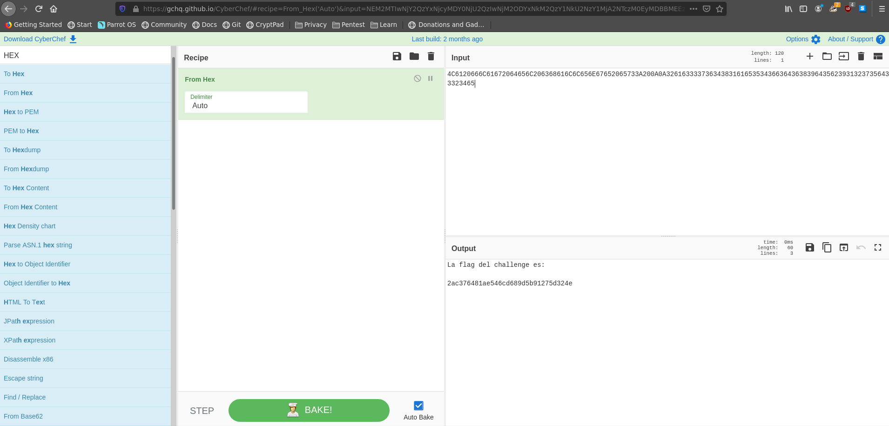

El resultado es:

```
La flag del challenge es: 

2ac376481ae546cd689d5b91275d324e
```

## Challenge 2
Este desafío es muy parecido al Challenge 1, pero cambiando la forma en que se cifra. Siendo el contenido del archivo **challenge2.txt** :
```
H375Y('-E;F-I;&QA.@H*9FQA9WMU=5]D96-O9&5?9G)E97-T>6QE?0``
```
Bastaría con hacer un decodificado desde UU-Encode:
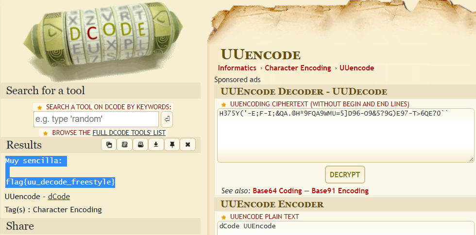

El resultado es:

```
Muy sencilla:

flag{uu_decode_freestyle}
```
## Challenge 3
Descargamos el archivo **challenge3.txt**, cuyo contenido nos recuerda a cómo los sistemas UNIX almacenan la información referente a los usuarios del sistema.
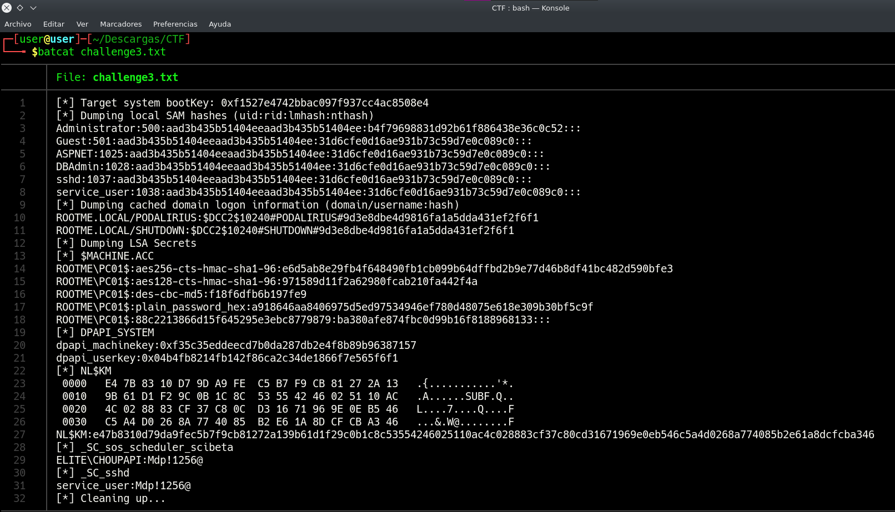

Como se nos pide la flag relativa al administrador, desencriptamos su hash.
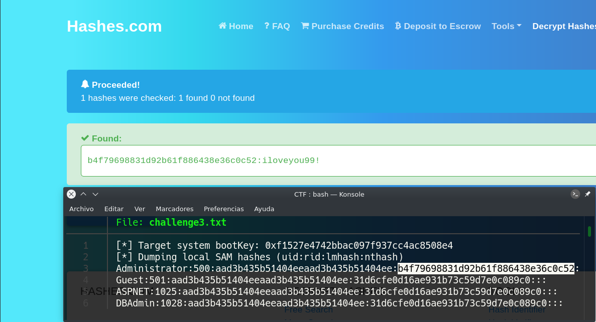

El resultado es:

```
iloveyou99!
```

## Challenge 4
A partir de aquí, los desafios empiezan a complicarse, pues nos será necesario usar otras herramientas, además de webs de descifrado.

En este desafio, se nos da un archivo comprimido, **protected.zip**, el cual necesita una contraseña para ser descomprimido.
Por otro lado, se nos da el archivo **challenge4.txt**, cuyo contenido es:

```
BRUDAgk7NjA6AAoeFg1ISgQ=
```
Para obtener la contraseña del archivo comprimido, usaremos la herramienta “zip2john”, definiendo el nombre del archivo ZIP con contraseña y redireccionando la salida hacia un archivo el cual contendrá el hash extraído.

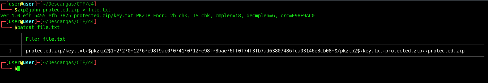

Luego, usaremos la herramienta "John The Ripper" para obtener la contraseña por fuerza bruta, a través del archivo antes creado vía "zip2john".

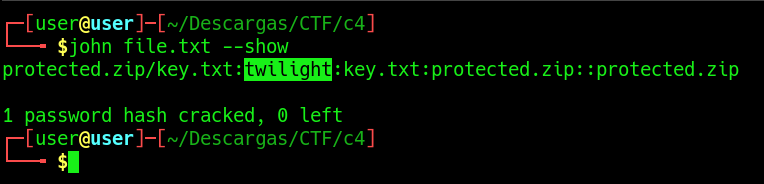

Ahora, sabemos que la contraseña del **protected.zip** es "twilight". Descomprimimos **protected.zip** y tenemos un nuevo archivo, **key.txt**, cuyo contenido es "cyber".

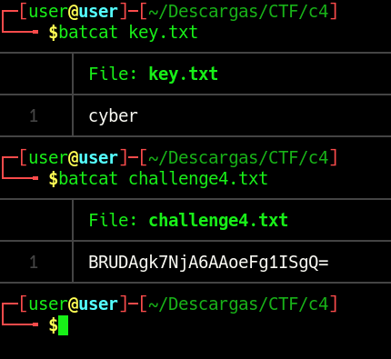

Con esto, ya tenemos todas las piezas del rompecabezas. Para obtener la flag, desciframos el contenido de **challenge4.txt** a partir de Base64, y el resultado, se vuelve a descifrar, pero desde "XOR", usando como clave el contenido de **key.txt**.
En este caso, es recomendable el uso de [CyberChef](https://gchq.github.io/CyberChef/), ya que nos permite encadenar distintos descifrados, de diferentes métodos.

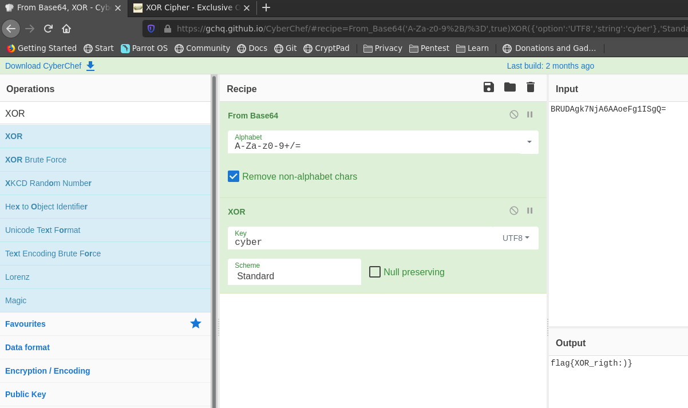

## Challenge 5
Para este desafío, usaremos el archivo **net2.pcapng**, proporcionado en el Challenge 3 del apartado Red. 

Este archivo lo visualizaremos usando Wireshark, por lo que nos será útil conocer la herramienta. Dentro de toda la información contenida en el archivo **net2.pcapng**, nos interesará inspeccionar el paquete 49.

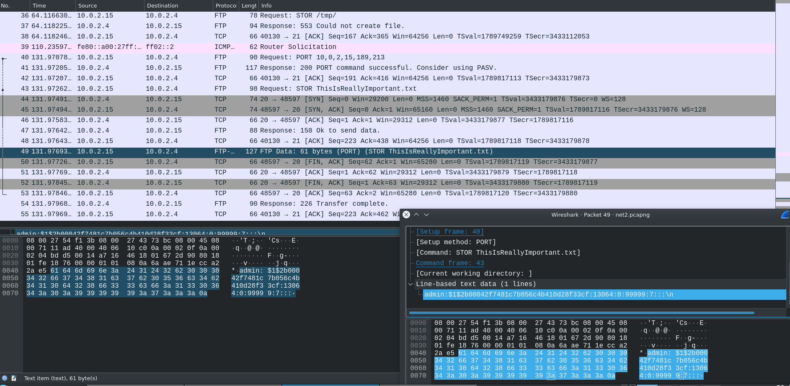

En la imagen, podemos ver que desde la dirección 10.0.2.15 se ha enviado un archivo usando el protocolo FTP a la dirección 10.0.2.4, ambas en la misma red privada. El archivo es **ThisIsReallyImportant.txt**, y su contenido lo podemos ver desde el propio Wireshark.
Su contenido, entre otras cosas, tiene una linea que nos recuerda, una vez mas, a un hash.

```
admin:$1$2b00042f7481c7b056c4b410d28f33cf:13064:0:99999:7:::\n
```

Desencriptamos el hash, y el resultado nos indica el siguiente paso.
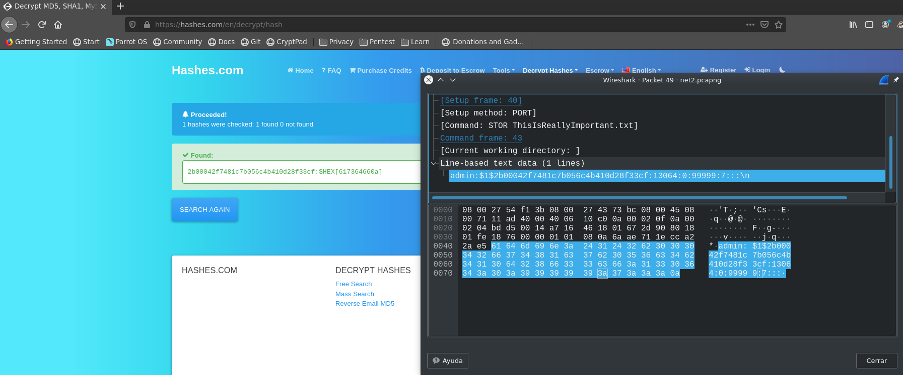

El contenido es:
```
$HEX[617364660a]
```
Por último, el resultado antes obtenido, lo traducimos del Hexadecimal:

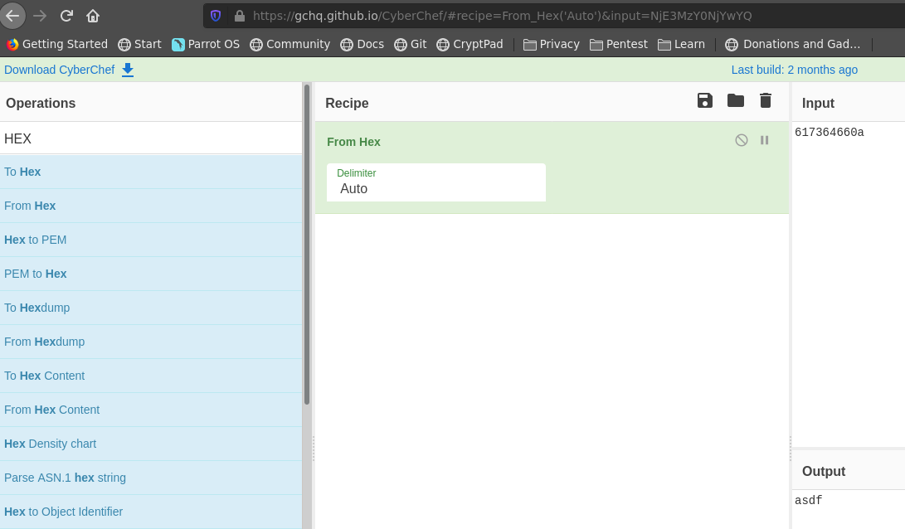

El resultado es:
```
asdf
```

Documentado por **Valentin** [Valentin](https://github.com/ValentinAvram)
