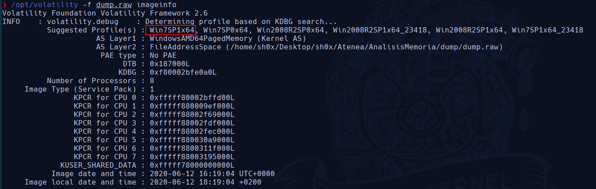
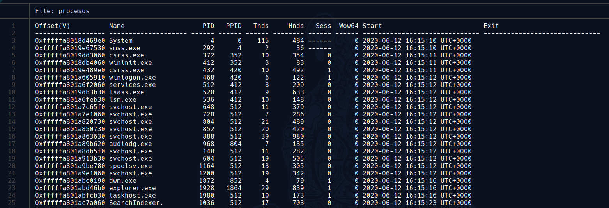
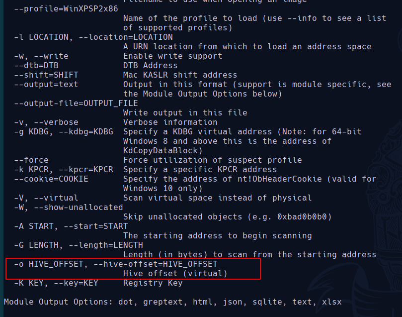
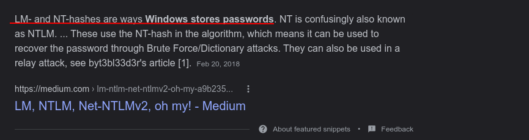

### Reto1: Profile
#### Description
Determina el perfil de S.O. a utilizar con este volcado de memoria.

#### Solution
Lo primero es ver antes que tipo de **SO** nos encontramos, para ello el comando **imageinfo** nos ofrece una visión general sobre el volcado de memoria. Nosotros para determinar el *profile* del SO nos vamos a fijar en el campo que pone **Suggested Profile**.

```
/opt/volatility -f dump.raw imageinfo
```



Cómo vemos en la figura estamos ante un *Windows 7 Service Pack 1 de 64bits*. 

Respuesta: ** flag{Win7SP1x64}**

### Reto2: Procesos
#### Description
¿Cuántos procesos había en ejecución en el equipo en el momento de la captura?

#### Solution
*¿ Qué es un proceso?*
Un [proceso](https://en.wikipedia.org/wiki/Process_(computing)) es una instancia de un programa en ejecución. Programas y procesos son entidades distintas. En un sistema operativo multitarea, múltiples instancias de un programa pueden ejecutarse simultáneamente. Cada instancia es un proceso separado.

Veámos cuántos procesos estaban en ejecución en el momento de la captura, para ello usaremos el comando **pslist** que nos imprime todos los procesos que están corriendo.

```
/opt/volatility -f dump.raw pslist > procesos
```

Ahora hacemos un **cat** a **procesos** que es el fichero dónde hemos dumpeado el output del comando **pslist**.



Nosotros queremos contar las líneas a partir de la número 3 que es dónde empieza el primer proceso, para ello escribiremos:

```
sed -i "1,2d" procesos
wc -l procesos
```

Y la respuesta es **43 procesos**.

Solution: **flag{43}**

### Reto 3
#### Description
¿Cuántas claves de registro hay en el raíz del hive SYSTEM? (incluyendo las volátiles)

#### Solution

Para hallar cuántas claves de registro hay en un **hive** en concreto, debemos usar la opción **printkey** que según el *man* de Volatility nos lo define de la siguiente manera:

- **printkey**: *Print a Registry Key, and its subkeys and values*

Sin embargo, nosotros debemos especificar a que **hive** queremos que se realice esta función. Para ello, veamos si **printkey** nos facilita el poder especificar una **hive** en concreto. 

```
/opt/volatility printkey --help
```


Observamos que nos permite especificar un **hive** en concreto a través de su **hive offset virtual**.

Por tanto, veamos con **hivelist** cuál es su **offset virutal** de **SYSTEM**

```
/opt/volatility -f dump.raw --profile=Win7SP1x64 hivelist
```


Ahora sí, podemos usar el parámetro **printkey -o** especificando el **offset hive (virtual)

```
/opt/volatility -f dump.raw --profile=Win7SP1x64 printkey -o 0xfffff8a000024010
```


Hay un total de 9 subkeys.

Solution:  **flag{9}**

### Reto 4: Password
#### Description
Necesitamos la contraseña de inicio de sesión del usuario Admin. ¿Cuál es?

#### Solution
Debemos saber que al igual que en **Linux** existe el */etc/shadow* dónde se almacenan las passwords cifradas y nos da información de los usuarios que hay en el sistema, en **Windows** también tenemos este fichero que se encuentra en la siguiente ruta *%SystemRoot%/system32/config/SAM*. [SAM](https://en.wikipedia.org/wiki/Security_Account_Manager)

Ahora bien, veamos que existe una opción en volatility que nos permite dumpear la información de este fichero.


```
/opt/volatility -f dump.raw --profile=Win7SP1x64 hashdump > hash
```


Ahora entra en uso la herramienta **John the ripper** para crackear las passwords.

Si buscamos por internet el tipo de hash con el que windows almacena las passwords encontramos lo siguiente:



Por tanto, vamos a especificar en la opción **--format** en John que sea de tipo **NT**.

```
john --show --format=NT hash
```

- Con **--show** le decimos que nos muestre si ha conseguido crackear el hash


Solution : **flag{administrador}**
