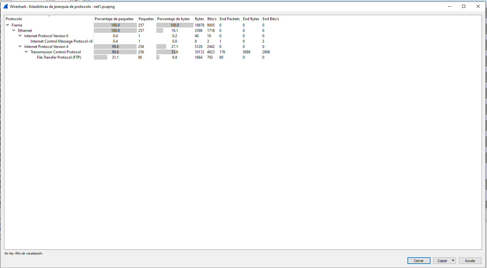
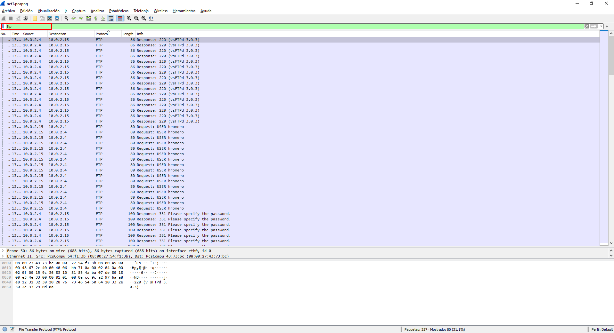
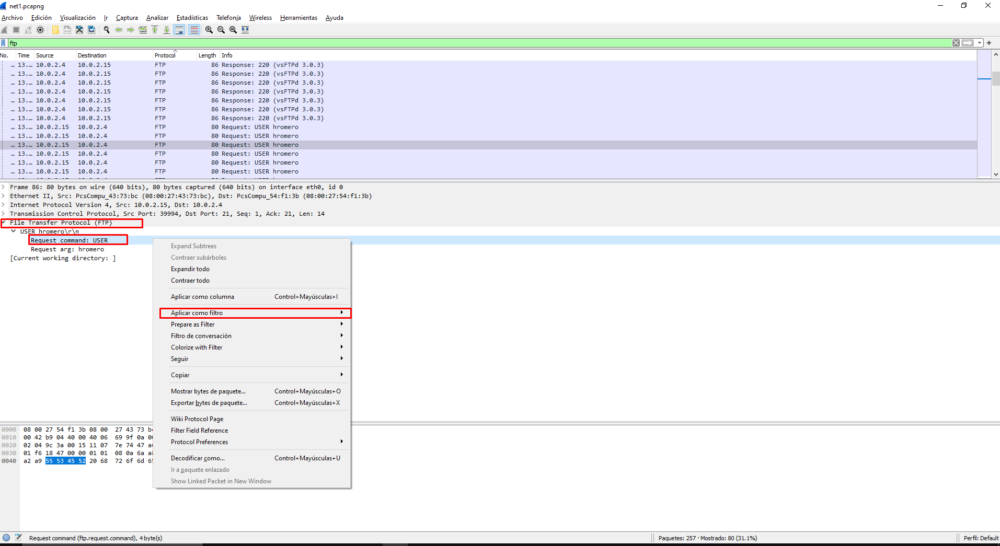
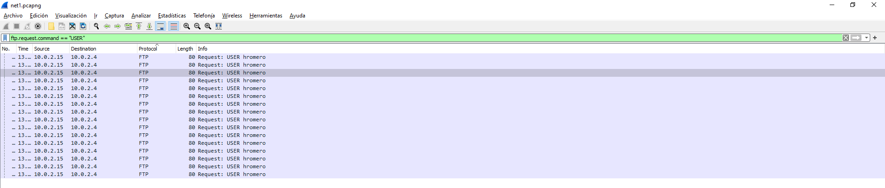
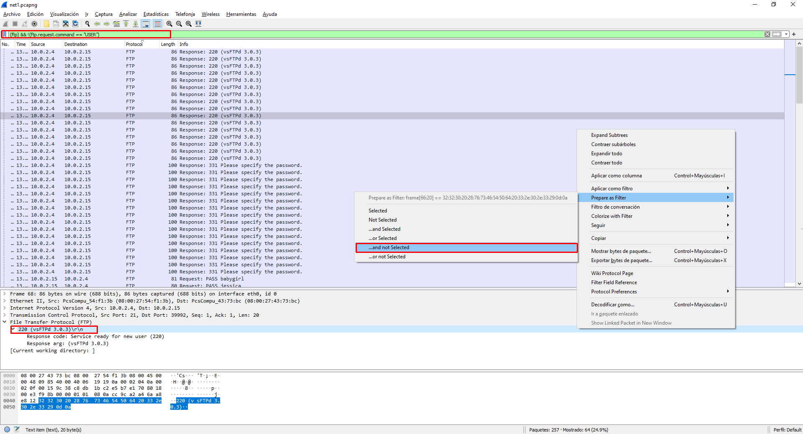
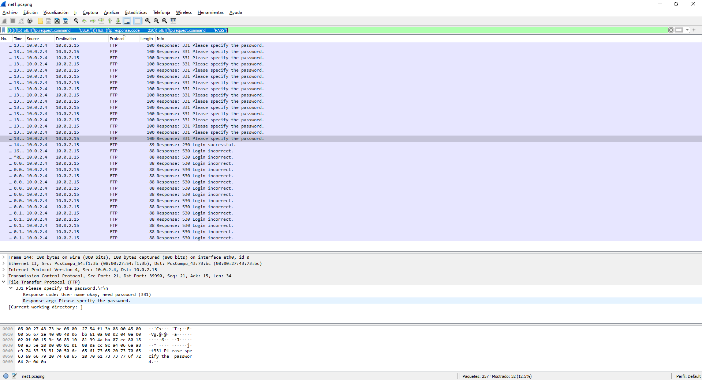
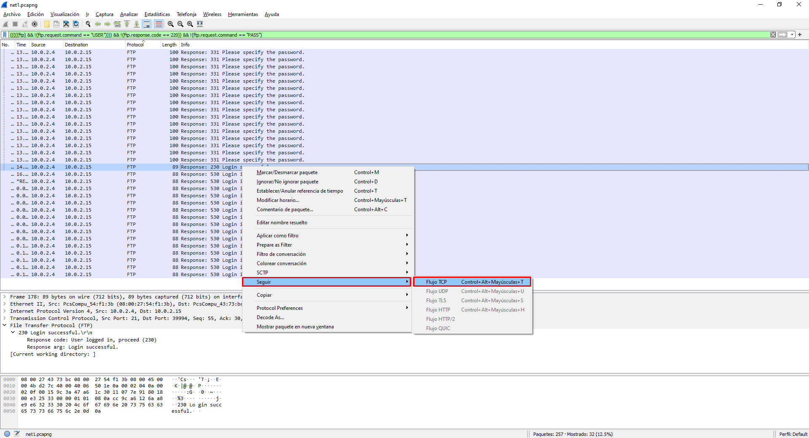
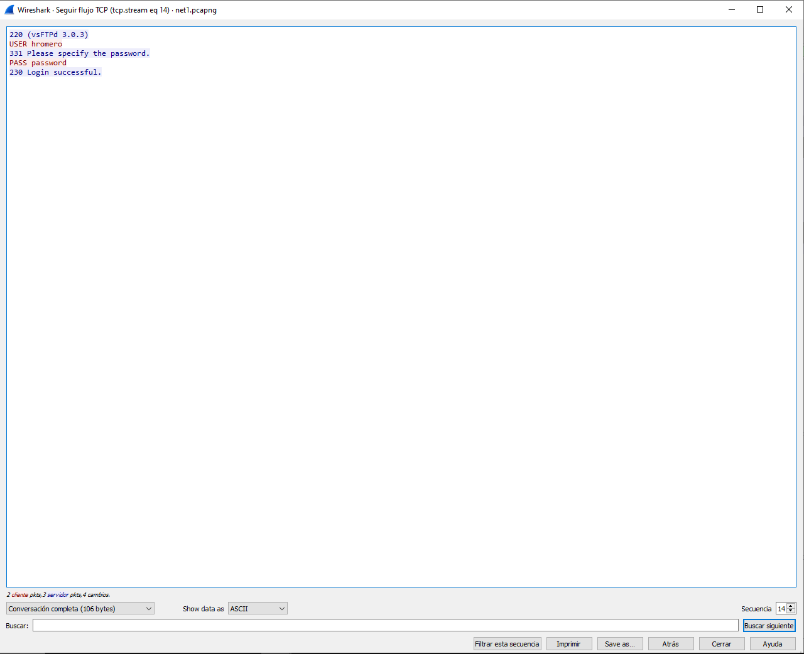

# Retos de red

## Challenge 1
#### Descripción
En el fichero [net1.pcapng](../assets/net1.pcapng) tenemos una traza de red de la captura de una empresa que sospecha de ataques dentro de la red.

Se tiene que determinar cual es el protocolo usado, la versión del servidor atacado y el usuario que esta intentando ser la víctima.

El formato de la flag es:

flag{protocolo:version:usuario}

#### Solución

Para este reto, obtenemos una captura de Wireshark, por lo tanto lo primero que tenemos que hacer es abrirla con este programa para ver si podemos obtener alguna pista.


Para poder filtrar por protocolo podemos utilizar la pestaña que nos facilita Wireshark, de esta forma a la hora de cambiar el orden podemos distinguir los protocolos: _TCP, FTP_

Otra opción para poder ver los protocolos, con sus jerarquías, podemos verlo en el menú de estadisticas -> jerarquías de protocolos.
.
Analizando estos resultados, podemos deducir que el __protocolo atacado es FTP__ puesto de los que podemos observar es el único que puede ser atacado mediante un ataque de usuario y contraseña (como nos indica el reto)

Para filtrar los paquetes, de forma que solo podemos observar los correspondientes a FTP, podemos utilizar el filtro
```
ftp
```
.

Filtrando por estos paquetes, podemos ver que en los primeros tenemos la __versión del servidor__ siendo esta _vsFTPd 3.0.3_.
Por último tenemos que determinar cual ha sido el usuario que está atacando.

Al estar los paquetes por filtro podemos ver que todos corresponde al __usuario hromero__, por lo tanto será este el único que esta intentando iniciar sesión y por lo tanto la víctima del ataque.

En el caso de esta captura, es sencillo de determinar. Sin embargo, si tuviéramos muchos paquetes FTP. Podríamos utilizar el filtro del paquete con el comando usuario. 
Esto puede sonar muy complejo, pero bastaría con seleccionar el campo dentro del paquete y con el menu de opciones, seleccionar _aplicar como filtro_


Obtenemos el resultado siguiente al aplicar el filtro


La flag del reto por lo tanto sería:

_flag{ftp:vsFTPd 3.0.3:hromero}_

## Challenge 2

## Descripción

Hemos detectado muchos intentos de inicio de sesión, para un usuario determinado. Se sospecha que el atacante a conseguido entrar en el sistema. Tenemos que determinar la cantidad de intentos de inicio de sesión y en el caso de que se infiltrara la contraseña. En el caso de que no haya conseguido entrar, la contraseña tendrá el valor null El formato de la flag es:

flag{número de intentos: contraseña}

## Solución

Para solucionar este reto, partimos de la captura del anterior. Para poder resolverlo tenemos que comprobar cuántos intentos de sesión se han realizado y cuál ha sido la contraseña (en el caso de que haya sido encontrada).

Para poder solucionarlo, vamos a utilizar los conocimientos del reto anterior:
* Sabemos que FTP no cifra el contenido (por lo tanto podemos obtener el usuario / Contraseña)
* Como hemos visto en el reto anterior, en la captura tenemos commando de FTP (como el comando USER)
* En el caso de que haya conexión (válida o no) obtendremos algún mensaje de respuesta.

Teniendo todo esto en cuenta, vamos a utilizar la capacidad de Wireshark, para ir creando filtros con la opción de __utilizar como filtro__ con los campos de un paquete

La idea es poder eliminar todos aquellos paquetes que no nos den información útil, estos paquetes que queremos eliminar son:

1.- Los que nos dan información del servidor (puesto que ya lo sabes)
2.- Aquellos paquetes que nos dan información del usuario que intenta acceder (puesto que ahora no es relevante)

Además, como hemos realizado antes, vamos a filtrar por protocolo _ftp_

Obtenemos el siguiente resultado

Para poder ir seleccionando los filtros, se realiza como se ve en la imagen. Buscamos en campo que queremos seleccionar (en este caso el protocolo ftp con los correspondientes campos) y con el botón derecho seleccionamos los paquetes para aplicarlos como filtro. Este filtro será _...and not selected_ para que se agregue al filtro.

[!] Tener en cuenta que es _... and not selected_ porque son los paquetes que queremos descartar.

Tenemos el filtro final
```
(((((ftp) && !(ftp.request.command == "USER")))) && !(ftp.response.code == 220)) && !(ftp.request.command == "PASS")
```
Aplicando el filtro tenemos el siguiente resultado

Con este filtro, ya tenemos la cantidad de paquetes que tienen como resultado de _Login Incorrect_

Para obtener la contraseña, tenemos que seleccionar el paquete de _Login successful_ y con el botón derecho utilizar la opción de __Seguir flujo TCP__

Al seleccionarlo tenemos el siguiente resultado:

Tenemos así la contraseña del usuario.

Por lo tanto la flag sería:

flag{16:password}

