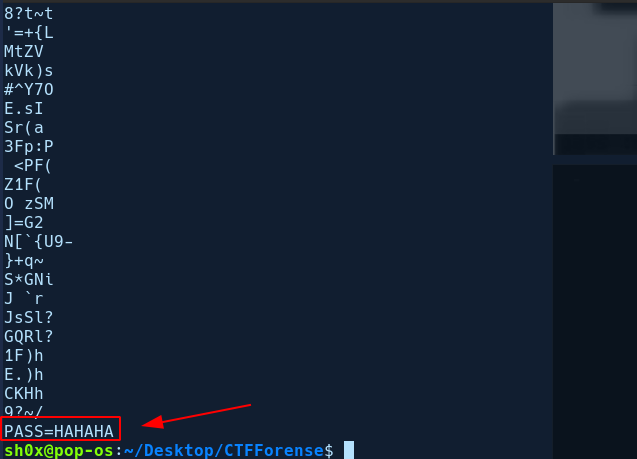

### Reto 1

En este primer reto nos da una imagen y debemos de conseguir la flag a través de la imagen proporcionada. Lo primero que se debe comprobar siempre es que la imagen **no haya sido modificada** anteriormente. Para ello vamos a acceder a la siguiente página: http://fotoforensics.com/


Subimos la imagen proporcionada y encontramos lo siguiente:


Observamos que en esa parte ha sido modificada, si abrimos la imagen y hacemos Zoom en esa zona, podemos encontrar lo siguiente:


**PASS=TOTORO**, por tanto ya tenemos la flag del desafío: **flag{TOTORO}**

### Reto 2

En el segundo reto también nos proporciona una imgen, por tanto vamos a realizar el mismo proceso que el anterior.


Sin embargo, no ha habido éxito en este caso. El siguiente paso que se suele usar es tirar del comando **strings** el cual nos proporciona cadenas legibles de una imagen. Si hacemos uso de strings, observamos lo siguiente:



Tendríamos la flag de este segundo reto: **flag{HAHAHA}**

### Reto 3

## Enunciado
El siguiente reto nos proporciona [esta](../images/stego/photo.jpg) imagen, pero sabemos que hay algo detrás de ella y necesitamos encontrarlo.


## Solución propuesta

1. Descargamos la imagen [photo.jpg](../images/stego/photo.jpg) proporcionada en la interfaz web.
2. Como siempre, verificamos que se trata de una imagen JPG, con la herramienta
`file` o la herramienta `exiftool`:

```bash
$ file photo.jpg
photo.jpg: JPEG image data, JFIF standard 1.01, resolution (DPI), density 96x96,
segment length 16, Exif Standard: [TIFF image data, big-endian, direntries=2],
progressive, precision 8, 1920x1280, components 3
```

Aparentemente, el fichero es lo que parece, una imagen JPEG. Pasamos a analizar
la imagen con alguna herramienta online para determinar si esconde algo que no
se ve a simple vista. Alguna de estas herramientas son:

- [29a.ch Photo Forensic](1)
- [imageforensic.org](2)
- [fotoforensic.com](3)

3. Utilizando [fotoforensic.com](3) no vemos nada extraño en el
_Error Level Analysis (ELA)_ que nos muestre una posible modificación de la
imagen.


   Sin embargo, si utilizamos la herramienta `strings` para extraer el
el contenido ASCII del fichero binario [photo.jpg](../images/stego/photo.jpg), obtenemos
algo muy interesante:

```bash
$ strings data/photo.jpg | tee tmp/step0.txt
JFIF
Exif
http://ns.adobe.com/xap/1.0/
<?xpacket begin='
' id='W5M0MpCehiHzreSzNTczkc9d'?>

...
...

=dSP57
>3TO0
ad`w
"https://www.dropbox.com/s/io1kaqznal2c10y/corrupted.zip?dl=0" 
```

5. Vemos que la última línea obtenida del comando es un enlace a dropbox. Si
descargamos el fichero de de Dropbox, mediante `wget` o copiando y pegando
el enlace en el navegador e intentamos extraerlo con el comando `unzip` veremos
que este fichero está protegido con contraseña. 

```bash
$ wget $(tail -1 tmp/step0.txt | sed 's/\"//g') -O tmp/step1.zip

...
...

$ unzip tmp/step1.zip 
Archive:  tmp/step1.zip
[tmp/step1.zip] FOR0x.png password: 
```

6. Como vimos en el taller, podemos usar la herramienta `john` para obtener
la contraseña del ZIP, pero antes debemos transformar este fichero ZIP en un
formato legible por dicha herramienta. Para ello usamos la herramienta
`zip2john`, que no está incluida en Kali Linux por defecto pero puede ser
instalada mediate la orden `sudo apt install zip2john`:

```bash
$ zip2john tmp/step1.zip > tmp/step2.zip.txt 
```

7. Ahora si, estamos en condiciones para obtener la contraseña con `john`:

```bash
$ john tmp/step2.zip.txt
Using default input encoding: UTF-8
Loaded 1 password hash (PKZIP [32/64])
Will run 2 OpenMP threads
Proceeding with single, rules:Single
Press 'q' or Ctrl-C to abort, almost any other key for status
Almost done: Processing the remaining buffered candidate passwords, if any.
Proceeding with wordlist:/usr/share/john/password.lst, rules:Wordlist
Proceeding with incremental:ASCII
```

8. Si dejamos que `john` actúe, veremos que se demora muchísimo, por lo que
podemos intentar realizar un ataque de diccionario en lugar de un ataque de
fuerza bruta puro. Para ello, cancelamos la ejecución actual, pulsando
`Ctrl+C` y utilizamos `john` con algún diccionario. 

   Podemos usar el diccionario rockyou.txt, con las contraseñas más usadas en el mundo, el cual se encuentra alojado en `/usr/share/wordlist/rockyou.txt.gz`
en Kali Linux (Puede descargarse de [github](4) si no está disponible en la
distribución utilizada) Este fichero está comprimido en formado GZIP, por lo
que para usar este diccionario en `john`, tenemos que descomprimirlo primero,
utilizando la instrucción `gzip`:

```bash
$ gzip -cd /usr/share/wordlists/rockyou.txt.gz | john --stdin step2.zip.txt
Using default input encoding: UTF-8
Loaded 1 password hash (PKZIP [32/64])
Will run 2 OpenMP threads
Press Ctrl-C to abort, or send SIGUSR1 to john process for status
pumpkinpie       (step1.zip/FOR0x.png)
1g 0:00:00:00  33.33g/s 682666p/s 682666c/s 682666C/s christal..michelle4
Use the "--show" option to display all of the cracked passwords reliably
Session completed
```

9. Ya tenemos la contraseña del fichero zip (`pumpkinpie`), así que pasamos a
descomprimirlo:

```bahs
$ unzip -P "pumpkinpie" tmp/step1.zip -d tmp/    
Archive:  tmp/step1.zip
  inflating: tmp/FOR0x.png
```


10. Al descomprimir el ZIP, aparentemente hemos obtenido una imagen PNG, pero
si volvemos a usar la herramienta `file`, vemos que no lo es:

```bash
$ file tmp/FOR0x.png
tmp/FOR0x.png: data
```

    El comando `file` nos indica que es un fichero binario `data`. Utilizando de
nuevo la herramienta `strings`, observamos que la segunda línea devuelta por
el comando es `jfif`. 

```bash
$ strings tmp/FOR0x.png
..xx
jfif
bExif

...
...

s_$`
&[^b'
;wV;
```

    Si entramos en [esta](5) página de wikipedia y buscamos `jfif`, veremos que
se trata de la cabecera de una imagen JPEG, pero corrupta, pues la cabecera
no se corresponde completamente.


11. Podemos comprobar de forma más exacta que la cabecera del fichero JPEG
está corrupta utilizando un visor hexadecimal como `hexdump` y filtrando la 
primera línea:

```bash
$ hexdump -C tmp/FOR0x.png | head -1
00000000  2e 2e 78 78 00 10 6a 66  69 66 00 01 38 35 2e 00  |..xx..jfif..85..|
```

   Observamos que los 4 primeros bytes no se corresponden con la cabecera
estándar de un fichero JPEG. Para recuperar este fichero, tendremos que
restaurar la cabecera, utilizando un editor hexadecimal como `hexedit`
(no está instalado por defecto en Kali Linux, se puede instalar con el comando
`sudo apt install hexedit`:

```bash
$ cp tmp/FOR0x.png solution.jpeg
$ hexedit solution.jpeg
```
   Esto nos abrirá un editor interactivo en el que podremos editar los 4 primeros
bytes, como se ve en la siguiente imagen:


   Una vez corregidos los cuatro primeros bytes, plusamos `Ctrl+x` y respondemos
`y` para guardar los cambios.

12. Una vez editado el fichero, solo tenemos que abrirlo con nuetro visor de
imágenes favorito y veremos la solición al _challenge_ en la esquina inferior
derecha:

```bash
$ feh solution.jpeg
```

 
## Resumen de comandos para impacientes
1. `strings data/photo.jpg | tee tmp/step0.txt`
2. `wget $(tail -1 tmp/step0.txt | sed 's/\"//g') -O tmp/step1.zip`
3. `zip2john tmp/step1.zip > tmp/step2.zip.txt`
4. `gzip -cd /usr/share/wordlist/rockyou.txt.gz | john --stdin tmp/step2.zip.txt`
5. `unzip -P "pumpkinpie" tmp/step1.zip -d tmp/`
6. `cp tmp/FOR0x.png solution.jpeg`
7. `hexedit solution.jpeg`
8. Cambiamos `2e 2e 78 78 00 10` por `ff d8 ff e0 00 10`.
9. Guardamos el fichero con `Ctrl-x` y pulsamos `y`.
10. Abrimos el fichero `solution.jpeg` con un visor de imágenes.


[1]: https://29a.ch/photo-forensic/
[2]: http://www.imageforensic.org
[3]: http://fotoforensics.com/
[4]: https://github.com/praetorian-inc/Hob0Rules/blob/master/wordlists/rockyou.txt.gz
[5]: https://en.wikipedia.org/wiki/List_of_file_signatures

Documentado este último reto por Rafael Savariego Fernández : [Rafael](https://github.com/p52safer)
