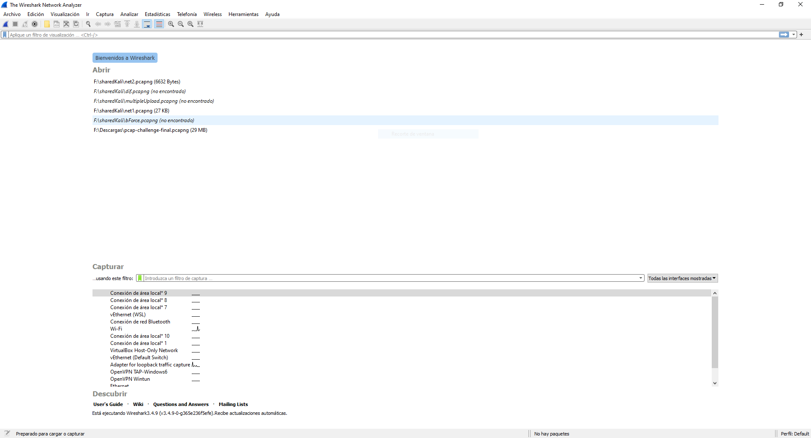
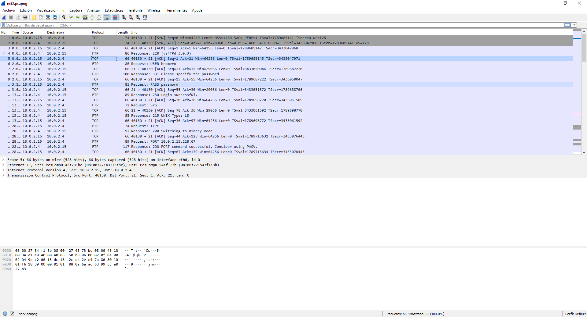

# Herramientas para análisis de red

## Wireshark
Wireshark es una herramienta que nos permite analizar protocolos de red. Es una de las herramientas más extendidas a lo largo del mundo debido a la facilidad de uso y utilidad de la misma.

Otra utilidad de Wireshark es que nos permite capturar los paquetes que estan circulando por la red, es decir, actúa com un _sniffer_ para poder obtener una captura de red para analizarla posteriormente.
### Instalación
Si nos encontramos en distribuciones Linux especializadas en seguridad (como Kali y Parrot) esta herramienta esta instalada. De lo contrario, podemos obtener los binarios desde su [web](https://www.wireshark.org/#download).

En entornos Linux es posbile encontrarla en los repositorios e instalarla con _apt_
```bash
sudo apt-get install wireshark
```

### Inicio 
Al inciar Wireshark obtenemos una ventana similar a esta:



Podemos distinguir dos secciones:

1. La parte superior, correspondiente a las capturas que hemos abierto recientemente.
2. La parte inferiorn, donde podemos seleccionar una de las interfaces que tenemos en nuestra máquina para poder capturar

Al abrir una captura de Wireshark pasaremos a visualizar el contenido. Obtenemos una venrana parecida a la siguiente:



A partir de aquí podemos comenzar a analizar la captura.