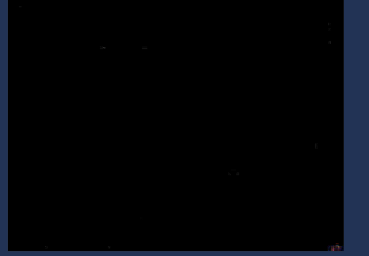

### Reto 1

En este primer reto nos da una imagen y debemos de conseguir la flag a través de la imagen proporcionada. Lo primero que se debe comprobar siempre es que la imagen **no haya sido modificada** anteriormente. Para ello vamos a acceder a la siguiente página: http://fotoforensics.com/

Subimos la imagen proporcionada y encontramos lo siguiente:

Observamos que en esa parte ha sido modificada, si abrimos la imagen y hacemos Zoom en esa zona, podemos encontrar lo siguiente:

**PASS=TOTORO**, por tanto ya tenemos la flag del desafío: **flag{TOTORO}**

### Reto 2

En el segundo reto también nos proporciona una imgen, por tanto vamos a realizar el mismo proceso que el anterior.

Sin embargo, no ha habido éxito en este caso. El siguiente paso que se suele usar es tirar del comando **strings** el cual nos proporciona cadenas legibles de una imagen. Si hacemos uso de strings, observamos lo siguiente:

Tendríamos la flag de este segundo reto: **flag{HAHAHA}**
