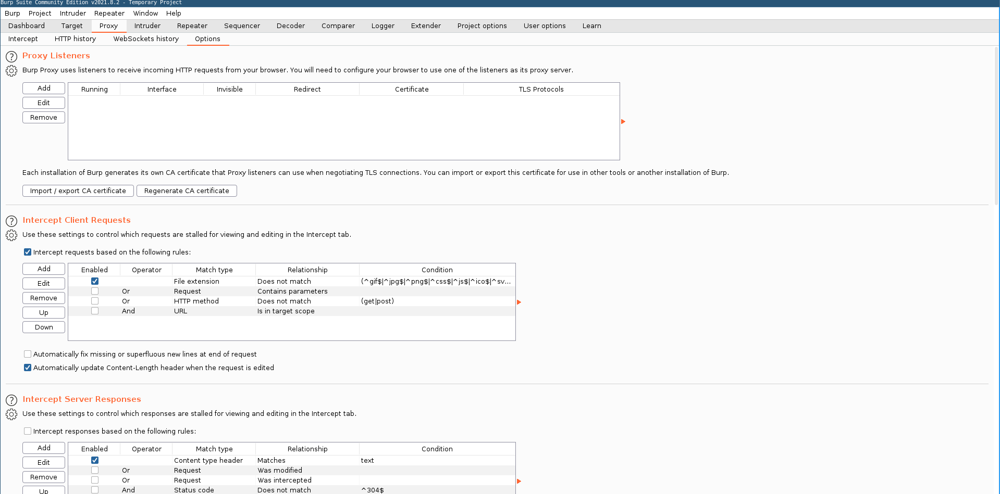
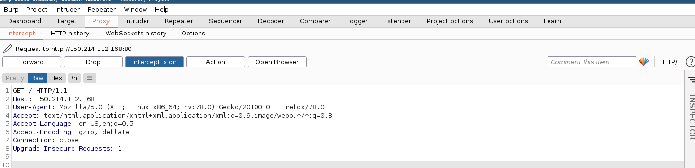

# Herramientas

## Burp Suite

### Características

Burp Suite es una herramienta que nos facilita las tareas a la hora de examinar las peticiones web.

La herramienta (principal) que nos ofrece Burp suite es la posibilidad de establecer un proxy entre nuestro equipo y cualquier petición web que realizamos hacia un servidor web.

Esta herramienta nos permite modificar cualquier petición. Además podemos utilizar otras funcionalidades como:

1.- Intruder: Nos permite modificar las peticiones web, por ejemplo, centrándonos en un punto concreto de la petición, de forma que podemos probar diferentes valores. La característica principal es __realizar ataques automatizados__.

2.- Repeater: Nos permite reenviar las peticiones web modificando los valores y observar la respuesta del servidor de forma muy sencilla (sin tener que salid de la aplicación)

3.- Target: Esta funcionalidad nos ofrece la posibilidad de escanear la aplicación web en busca de información sobre la misma

4.- Sequencer: Esta funcionalidad nos permite analizar la _aleatoriedad_ de las partes de la aplicación como los _token de sessión_

5.- Decoder: Nos permite Codificar / Decodificar diferentes Strings (útil por ejemplo para realizar encoding en formularios)

6.- Comparer: Integra la funcionalidad del comando diff para peticiones web

7.- DOM Invader: Nos permite encontrar __vulnerabilidades DOM XSS__ en la web.

8.- Logger: Nos permite tener un control de todas las peticiones hechas por burp suite

### Instalación y configuración

Podemos obtener la version _community__ desde la .

Obtendremos un paquete compilado _.jar_ el cual podremos abrir en cualquier sistema que tengamos Java instalado. Desde terminal, podemos usar el comando
````shell
java -jar burp.jar
````
Como resultado obtendremos la posibilidad de crear un proyecto (donde se almacenará toda la información del análisis realizado a una aplicación web). En el caso de realizar pequeñas pruebas, podemos seleccionar la opción de _temporal project_

#### Configurar la funcionalidad proxy
Una vez abierto podemos configurar la funcionalidad de proxy.

En la barra superior tenemos que seleccionar la opción de proxy. Dentro de este menú seleccionamos la opción de _Options_. Obtendremos una ventana igual a la siguiente.


Dentro de la sección __Proxy Listeners__ tendremos que agregar un nuevo elemento.
Al agregar un proxy nuevo tendremos que configurarlo. Lo más importante a configurar es el puerto donde va a escuchar el proxy. Este campo se corresponde al _Bind to Port_ del siguiente formulario.

Por defecto Burp Suite configura el puerto 8080. En el caso de que tengamos corriendo algún servicio en este puerto,puede causar problema por lo cual podemos escoger cualquiera de los disponibles.
Una vez seleccionado el puerto se creará el proxy. Solo quedaía configurarlo dentro de nuestro navegador.

### Configuración de proxy en Firefox

Dentro de Firefox tenemos que irnos a las opciones y seleccionar la funcionalidad de proxy. Introducimos los datos como se muestran en pantalla. __Teniendo en cuenta el puerto que hemos configurado anteriormente en Burp Suite__


Una vez realizado todos los pasos, activamos el modo _intercept_ y obtendremos todos los paquetes que accedamos en el navegador.


